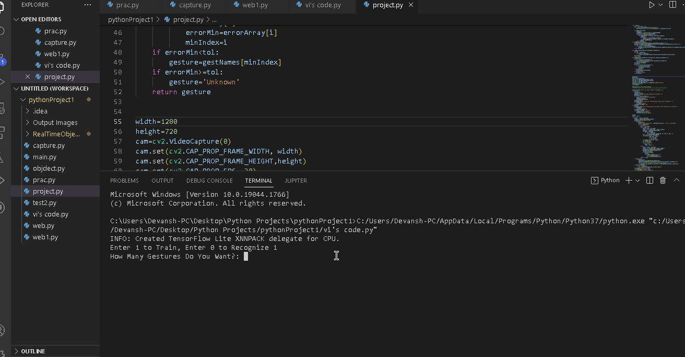

# Sign-Language-AI (Group Project) 

- Collaborated with **Ashmika Ballamudi** and **Vi Nguyen**

Created a Live Hand Detection program which understands ASL language. This tool is completely user friendly. It helps to detect ASL patterns which can be trained by the user OR the user can also load files having that gestures into the program. This is comparitively faster and way more optimized than the current solutions available on the web world.

This is based on using some well-known data structures like arrays, maps and tuples. For simplicity of gesture capturing, the program is enabled with a countdown timer to give the user more flexibiltiy in getting ready for a camershot!🤳🤳✨ 

**Sign Language Detection** is a python software which is designed to detect hand movements and patterns. This can help in understanding and conversing with those children who cannot hear (We are working on adding a feature of out voice command which can further help to communicate with people who cannot see). The best part i it is not only specific to a particular person it works for everyone and gives nearly 100% accurate detections. It is independent on how far the hand is while capturing or detection.

Submitted by: **Devansh Goel**

Time spent: **1** month spent in total

## User Stories

The following **required** functionality is completed:

* [x] Program can **Analyze user hand movements**
* [x] Program can **Detect different hand patterns**
* [x] Program can **It can capture different gestures by pressing 't'**
* [x] Program can **Stores them as Pkl file so that data integrity is maintained**
* [x] Program can **detect those saved gestures even after restart**
* [x] Program can **Shows gesture text and countdown on screen** 
* [x] User can **See the current FPS on the right top of the screen**
* [x] User can **Safely exit the program** 

Here's a walkthrough of implemented user stories:

## Video Walkthrough **Training**

## Video Walkthrough **Capturing**

## Video Walkthrough **Detecting**

## Video Walkthrough **Restarting and Successful Detection**

GIF created with [LiceCap](http://www.cockos.com/licecap/).

## Notes

It was great to use different libraries like opencv, tensorflow, mediapipe, pycaw, numpy and my very own **personal hand detection file.** Strong efforts by other team members made me accomplish this difficult task. It was fun and tough but we did not lose hope till the end.

**I would like to give a special thanks to Google. Youtubers, professors and reasearchers who gave their valuable knowledge to us and helped us successfully achieve this great program.**

## License

    Copyright [2022] [Devansh]

    Licensed under the Apache License, Version 2.0 (the "License");
    you may not use this file except in compliance with the License.
    You may obtain a copy of the License at

        http://www.apache.org/licenses/LICENSE-2.0

    Unless required by applicable law or agreed to in writing, software
    distributed under the License is distributed on an "AS IS" BASIS,
    WITHOUT WARRANTIES OR CONDITIONS OF ANY KIND, either express or implied.
    See the License for the specific language governing permissions and
    limitations under the License.
